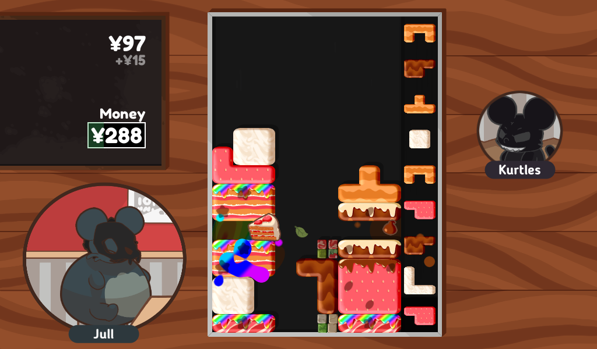
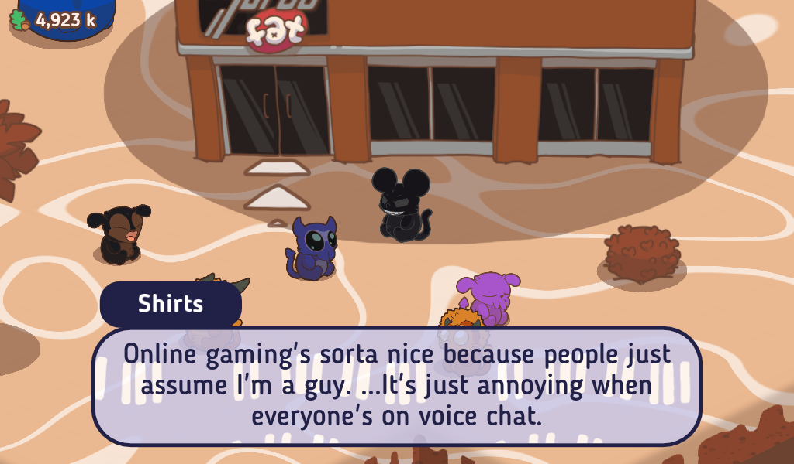

# Turbo Fat

*Turbo Fat* is a block-dropping puzzle game for Windows, Linux, Android and HTML5.

Turbo Fat was inspired by block-stacking games of the 90s, but builds on them with new pieces, new moves, new ways to score, and hilarious level gimmicks! Misdrop a piece? Use a squish move to fix it! Want higher scores? Build up a combo of 10 lines, 20 lines, 100 lines... there is no limit! Waiting for that crucial line piece? Don't wait long, we got rid of those! (Hey, nobody said it would be easy...)

The game also includes an adventure mode where you can interact with other monsters. This will eventually grow to include many characters to meet with unique stories, worlds to explore, and crazy puzzle challenges.

**Turbo Fat is free; you can download the latest version on the [releases page](https://github.com/Poobslag/turbofat/releases), or play it online at [itch.io](https://poobslag.itch.io/turbo-fat).**

# Social Media Links

If you're interested in Turbo Fat, join the community on Discord, or follow its updates on Twitter, Reddit, itch.io and of course GitHub!

- Steam: https://store.steampowered.com/app/2213410/Turbo_Fat
- Discord: https://discord.gg/yU6aurT
- itch.io: https://poobslag.itch.io/turbo-fat
- Twitter: https://twitter.com/poobslag/
- Reddit: https://www.reddit.com/r/turbofat/

# For Developers

If you want to run the Turbo Fat source code, see [Workstation Setup](https://github.com/Poobslag/turbofat/wiki/workstation-setup) in the Turbo Fat wiki.

# License

Turbo Fat's code and framework are licensed under the MIT licence. Please see the [LICENSE.md](LICENSE.md) file for more information. tl;dr you can do whatever you want as long as you include the original copyright and license notice in any copy of the software/source.

Turbo Fat's game resources are licensed under the CC-BY-NC license. Please see the [LICENSE2.md](LICENSE2.md) file for more information. tl;dr you can share it and change it, but you can't use it to make money.

Turbo Fat includes other resources which have their own licenses. This includes creative commons resources and purchased resources. The licenses for these resources are accessible in the [/license](/license) folder.

Please note that this does not cover the usage of the "Turbo Fat" branding in any software, resources, advertising or promotion, as this is protected by trademark law.
