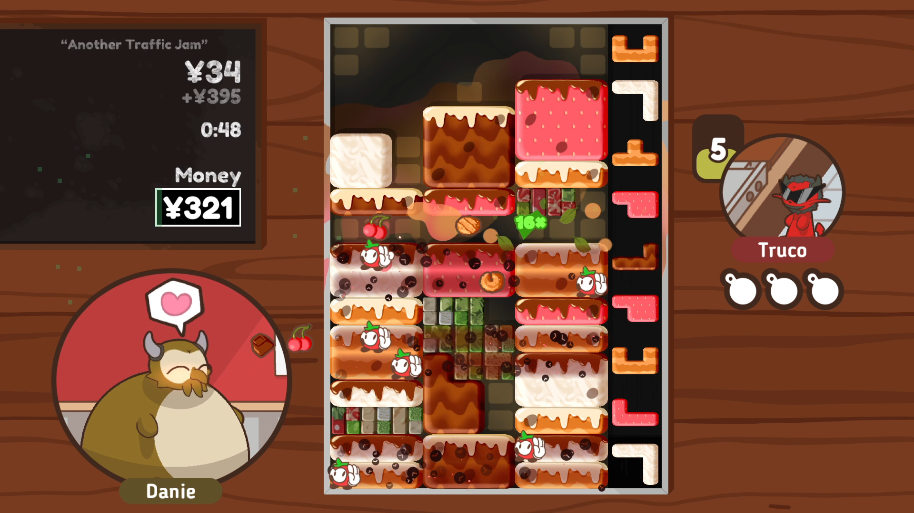

# Turbo Fat

Turbo Fat is a block-dropping puzzle game. It's inspired by a few other block-dropping games but breaks some rules.

Instead of being rewarded for clean horizontal stacks, multiline clears and T-spins, you're rewarded for messy vertical stacks, 3x3 boxes and 'squish moves' where you smush pieces into impossible positions.

The game also includes a story mode where you can interact with other monsters. This will eventually grow into an immersive story mode with many characters to meet, worlds to explore, and unique puzzle challenges.

## Summary

Rotate the falling pieces and arrange them into lines to clear them. To earn more money, arrange your pieces into 3x3, 3x4 and 3x5 boxes. The more of these boxes you make, the more money you'll get.

Another way to earn more money is to clear a lot of lines in a row. It doesn't have to be at the same time. Making boxes also keeps your combo going.

Pressing and holding the 'soft drop' key lets you move pieces past each other. This can help to recover from a poorly placed piece, but also helps when trying to make boxes.

## Controls

In the puzzle mode, <kbd>Left</kbd> and <kbd>Right</kbd> move the piece, <kbd>Z</kbd> and <kbd>X</kbd> rotate it and <kbd>Down</kbd> drops it. <kbd>Up</kbd> or <kbd>Shift</kbd> drop it more quickly. <kbd>Esc</kbd> quits the game.

In the overworld, <kbd>Up</kbd>, <kbd>Down</kbd>, <kbd>Left</kbd> and <kbd>Right</kbd> move your character. <kbd>Z</kbd> talks, and <kbd>Shift</kbd> rewinds dialog. <kbd>Esc</kbd> quits the game.

Gamepads are also supported.

For more details about the scoring system or game mechanics, see [How to play](https://github.com/Poobslag/turbofat/wiki/How-to-play) in the Turbo Fat wiki.

# License

Turbo Fat's code and framework are licensed under the MIT licence. Please see the [LICENSE.md](LICENSE.md) file for more information. tl;dr you can do whatever you want as long as you include the original copyright and license notice in any copy of the software/source.

Turbo Fat's game resources are licensed under the CC-BY-NC license. Please see the [LICENSE2.md](LICENSE.md) file for more information. tl;dr you can share it and change it, but you can't use it to make money.

Turbo Fat includes other resources which have their own licenses. This includes creative commons resources and purchased resources. The licenses for these resources are accessible in the [/license](/license) folder.

Please note that this does not cover the usage of the "Turbo Fat" branding in any software, resources, advertising or promotion, as this is protected by trademark law.
