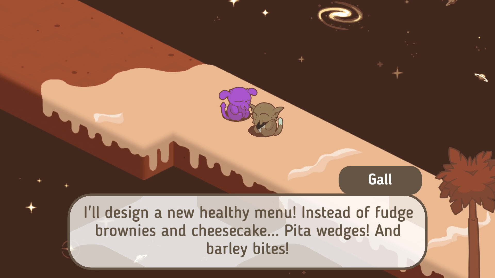

# Turbo Fat

Turbo Fat is a block-dropping puzzle game for Windows, Linux, iOS, Android and HTML5.

**Turbo Fat is free; you can download the latest version on the [releases page](https://github.com/Poobslag/turbofat/releases), or play it online at [itch.io](https://poobslag.itch.io/turbo-fat).**

The game is inspired by a few other block-dropping games but breaks some rules. Instead of being rewarded for clean horizontal stacks, multiline clears and T-spins, you're rewarded for messy vertical stacks, 3x3 boxes and 'squish moves' where you smush pieces into impossible positions.

The game also includes a story mode where you can interact with other monsters. This will eventually grow to include many characters to meet with unique stories, worlds to explore, and crazy puzzle challenges.

## Summary

Rotate the falling pieces and arrange them into lines to clear them. To earn more money, arrange your pieces into 3x3, 3x4 and 3x5 boxes. The more of these boxes you make, the more money you'll get.

Another way to earn more money is to clear a lot of lines one after the other, which builds a combo. Making boxes also keeps your combo going.

Pressing and holding the 'soft drop' key lets you move pieces past each other. This can help to recover from a poorly placed piece, but also helps when trying to make boxes.

## Controls

  * <kbd>Left</kbd> or <kbd>Right</kbd> moves your piece.
  * <kbd>Z</kbd> or <kbd>X</kbd> rotates your piece.
  * <kbd>Down</kbd> lowers your piece.
  * <kbd>Space</kbd>, <kbd>Up</kbd> or <kbd>Shift</kbd> drops your piece immediately.
  * <kbd>Esc</kbd> brings up a menu.

Gamepads are also supported.

For more details about the scoring system and game mechanics, see [How to play](https://github.com/Poobslag/turbofat/wiki/How-to-play) in the Turbo Fat wiki.

# Social Media Links

Turbo Fat is still in development! If you're interested, join the community on Discord, or follow its progress on Twitter, Reddit, itch.io and of course GitHub!

- Discord: https://discord.gg/yU6aurT
- Twitter: https://twitter.com/poobslag/
- Reddit: https://www.reddit.com/r/turbofat/
- itch.io: https://poobslag.itch.io/turbo-fat
- GitHub: https://github.com/Poobslag/turbofat

# License

Turbo Fat's code and framework are licensed under the MIT licence. Please see the [LICENSE.md](LICENSE.md) file for more information. tl;dr you can do whatever you want as long as you include the original copyright and license notice in any copy of the software/source.

Turbo Fat's game resources are licensed under the CC-BY-NC license. Please see the [LICENSE2.md](LICENSE.md) file for more information. tl;dr you can share it and change it, but you can't use it to make money.

Turbo Fat includes other resources which have their own licenses. This includes creative commons resources and purchased resources. The licenses for these resources are accessible in the [/license](/license) folder.

Please note that this does not cover the usage of the "Turbo Fat" branding in any software, resources, advertising or promotion, as this is protected by trademark law.
